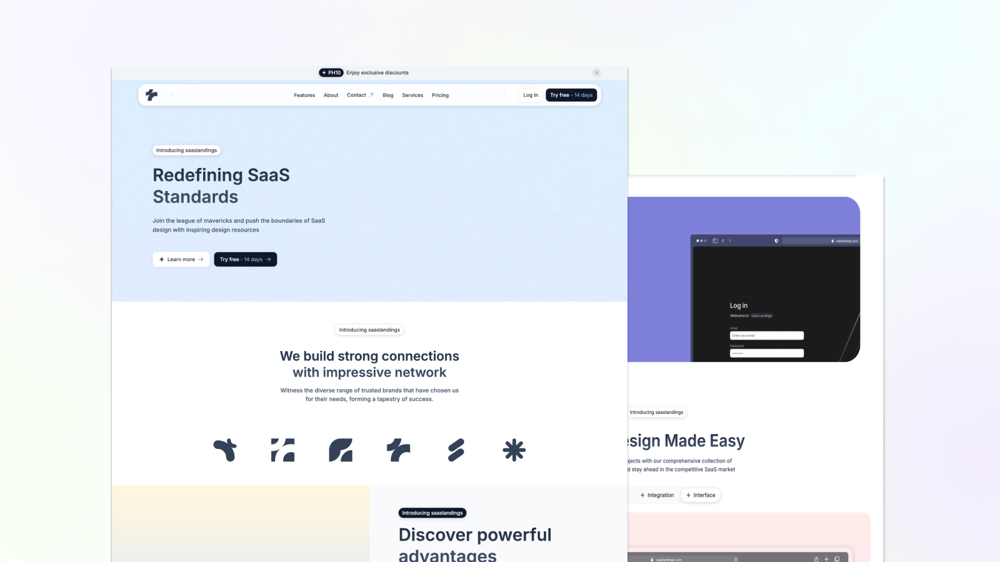

# Tailkits Astro

A modern, beautiful Astro starter theme powered by Tailwind CSS. Perfect for building fast, responsive websites with exceptional performance and developer experience.

## ✨ Features

- **⚡ Lightning Fast**: Built with Astro for optimal performance with zero JS by default
- **🎨 Beautiful Design**: Modern UI components styled with Tailwind CSS v4
- **📱 Fully Responsive**: Mobile-first design that looks perfect on all devices
- **🔧 Developer Friendly**: TypeScript support, modern tooling, and clean code structure
- **🚀 SEO Optimized**: Meta tags, semantic HTML, and performance-focused
- **🎯 Accessible**: WCAG compliant with proper focus states and semantic markup


> **💡 Want more components?** Check out 200+ premium landing page components and sections at [TailKits UI](https://tailkits.com/ui/) - perfectly matching this template's design system and ready to copy & paste into your Astro project.

## 🚀 Quick Start

### Prerequisites

- Node.js 18+ 
- npm, yarn, or pnpm

### Installation

1. **Clone the repository**
   ```bash
   git clone https://github.com/yourusername/tailkits-astro.git
   cd tailkits-astro
   ```

2. **Install dependencies**
   ```bash
   npm install
   # or
   yarn install
   # or
   pnpm install
   ```

3. **Start the development server**
   ```bash
   npm run dev
   # or
   yarn dev
   # or
   pnpm dev
   ```

4. **Open your browser**
   
   Visit [http://localhost:4321](http://localhost:4321) to see your site running locally.

## 🛠️ Tech Stack

- **[Astro](https://astro.build)** - The web framework for content-driven websites
- **[Tailwind CSS v4](https://tailwindcss.com)** - A utility-first CSS framework
- **[TypeScript](https://www.typescriptlang.org)** - JavaScript with syntax for types
- **[Inter Font](https://fonts.google.com/specimen/Inter)** - Modern, clean typography

## 📁 Project Structure

```
/
├── public/
│   └── favicon.svg
├── src/
│   ├── components/      # Reusable UI components
│   │   ├── Banner.astro
│   │   ├── Cta.astro
│   │   ├── Feature.astro
│   │   ├── Footer.astro
│   │   ├── Hero.astro
│   │   ├── HowItWorks.astro
│   │   ├── LogoCloud.astro
│   │   ├── Navigation.astro
│   │   ├── Pricing.astro
│   │   ├── Stats.astro
│   │   └── Testimonials.astro
│   ├── layouts/         # Page layouts
│   │   └── BaseLayout.astro
│   ├── pages/           # File-based routing
│   │   └── index.astro
│   └── styles/          # Global styles
│       └── global.css
├── astro.config.mjs
├── tailwind.config.mjs
├── tsconfig.json
└── package.json
```

## 🎨 Customization

> **⚠️ Production Note**: This template includes an optional “Made with Tailkits UI” badge in src/pages/index.astro for the demo. You may remove it for production

### Components

The theme is built with modular components that you can easily customize:

- **`BaseLayout.astro`** - Main layout with HTML structure and meta tags
- **`Banner.astro`** - Dismissible announcement banner
- **`Navigation.astro`** - Header navigation with mobile menu
- **`Hero.astro`** - Hero section with gradient text and CTA buttons
- **`LogoCloud.astro`** - Company logos display section
- **`Feature.astro`** - Features showcase with benefits list
- **`Stats.astro`** - Statistics display with large numbers
- **`Cta.astro`** - Call-to-action section
- **`HowItWorks.astro`** - Process explanation section
- **`Testimonials.astro`** - Customer testimonials carousel
- **`Pricing.astro`** - Pricing plans with feature comparison
- **`Footer.astro`** - Footer with links and social media

### Colors

The theme uses Tailwind's default blue color palette as the primary color. You can easily change this by:

1. Updating component files to use different color classes (e.g., `bg-green-600` instead of `bg-blue-600`)
2. Or add custom colors in `tailwind.config.mjs`:

```js
theme: {
  extend: {
    colors: {
      primary: {
        // Your custom color scale
        50: '#eff6ff',
        // ... rest of your colors
      },
    },
  },
},
```

### Typography

The theme uses Inter font from Google Fonts. You can change this in:

1. `src/layouts/BaseLayout.astro` - Update the Google Fonts link in the SEO component
2. `tailwind.config.mjs` - Update the font family configuration
3. `src/styles/global.css` - Update the body font-family

### Components

Custom component classes are defined in `src/styles/global.css`:

- `.container-custom` - Responsive container with padding
- `.btn-primary` / `.btn-secondary` - Button styles
- `.card` - Card component style
- `.text-gradient` - Gradient text effect

## 🚀 Deployment

### Build for Production

```bash
npm run build
```

This creates a `dist/` folder with your built site ready for deployment.

### Deploy to Popular Platforms

- **Vercel**: Connect your GitHub repo to Vercel for automatic deployments
- **Netlify**: Drag and drop the `dist/` folder or connect via Git
- **GitHub Pages**: Use the official Astro GitHub Pages action
- **Cloudflare Pages**: Connect your repo for edge deployment

See the [Astro deployment docs](https://docs.astro.build/en/guides/deploy/) for more options.

## 📚 Documentation

- [Astro Documentation](https://docs.astro.build)
- [Tailwind CSS Documentation](https://tailwindcss.com/docs)
- [TypeScript Documentation](https://www.typescriptlang.org/docs)

## 🤝 Contributing

Contributions are welcome! Please feel free to submit a Pull Request. For major changes, please open an issue first to discuss what you would like to change.

## 📄 License

This project is licensed under the MIT License - see the [LICENSE](LICENSE) file for details.

## 🙏 Acknowledgments

- Built with [Astro](https://astro.build)
- Styled with [Tailwind CSS](https://tailwindcss.com)
- Icons from [Heroicons](https://heroicons.com)
- Typography by [Inter](https://rsms.me/inter/)

---